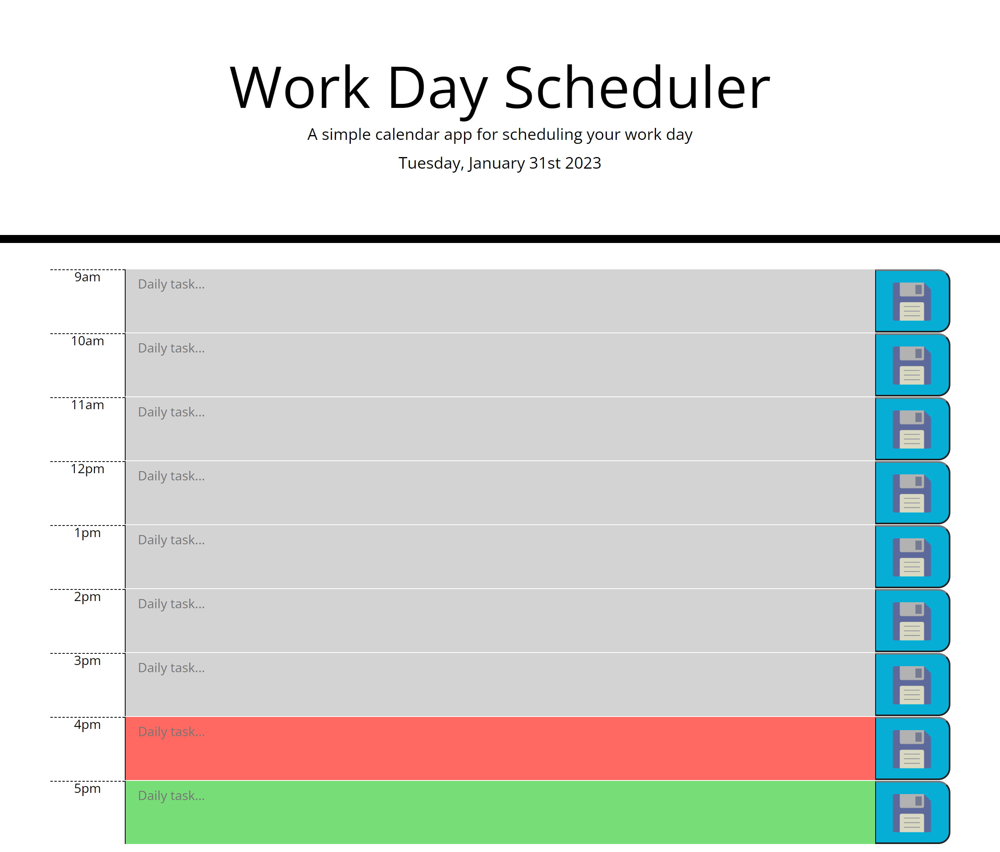

# George Ryder - Daily-Planner-App

## Description

This project is a simple calendar application that allows a user to save events for each hour of the day.

My main motivation behind building this project was to learn more about third party APIs specifically Jquery and moment.js. Both of these third party APIs were things I had no experience using so it was good to learn further about them and how they can be used in real-world applications. I also worked further with local storage to build up my understanding of that. I built this project again, to work on third party API elements but also to have a real-world scheduler that I can use to help me plan my days which means it can help me to stay better organised. I learnt a lot during this project. I learnt more about DOM maniupation through the use of Jquery and I learnt a lot about time in moment.js and how to use that, not just statically, but also in conditonal statements to make my websites more dynamic. Throghout this week, I also gained a greater knowledge in traversing documentation having to use both the Jquery and moment.js documentation whilst working on this project. This is an important skill to learn as a developer so early practice in this will help me in the longer-term future. I believe that there are some elements that can be improved on this website for the future. The main thing I want to improve is the hard-coded elements for getting the elements in local storage. Whilst it works fine for an application that is only taking into account the 9-5pm routine, if I wanted to update this to a 24 hour planner or a weekly planner then these hard-coded elements would present a challenge to change. This is hopefully something I can come back in the future to iterate on. Overall, I believe this project went well and I learnt a lot, whilst there is a few elements that can be improved upon, I am satisfied with the progress I have made.

## Installation 

Github repository: https://github.com/NotGeorgeHere/Daily-Planner-App

Live Deployment Page: https://notgeorgehere.github.io/Daily-Planner-App

## Usage

